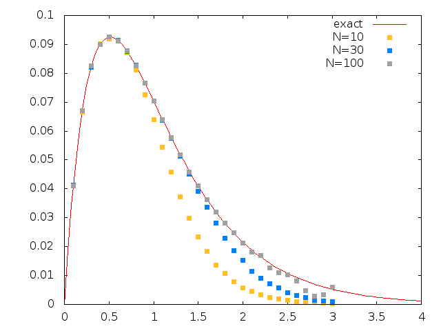

A first external code
=====================

.. highlight:: c

As a first exercice you can try to write a Monte Carlo code
for an Ising chain in a magnetic field. Your goal is to
write this code as an external project and to use the
Monte Carlo class provided by TRIQS.

The Monte Carlo class is described `on this link <../mctools/contents.html>`_.
Take some time to read the chapter, but don't read the complete example
at the end of the chapter because it is precisely what you need to
do here. You can check your implementation later.

Ising chain in magnetic field
-----------------------------

Here's the Hamiltonian for the problem of Ising spins in a magnetic field

.. math::

  \mathcal{H} = -J \sum_{i=1}^N \sigma_i \sigma_{i+1} - h \sum_{i=1}^N \sigma_i.

The goal is to find the magnetization per spin :math:`m` of the system for 
:math:`J = -1.0`, a magnetic field :math:`h = 0.5` as a function of
the inverse temperature :math:`\beta`. You can see how the results
change with the length of the chain :math:`N`.

Solution
--------

In the limit :math:`N \rightarrow \infty`, the solution for the magnetization
is

.. math::

  m = \frac{\sinh(\beta h) + \frac{\sinh(\beta h)\cosh(\beta h)}{\sqrt{\sinh^2(\beta h) + e^{-4\beta J}}}}
           {\cosh(\beta h) + \sqrt{\sinh^2(\beta h) + e^{-4\beta J}}}.

Here's a plot of :math:`m` versus :math:`\beta` for different values of :math:`N`:

